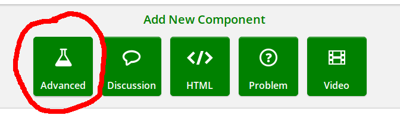
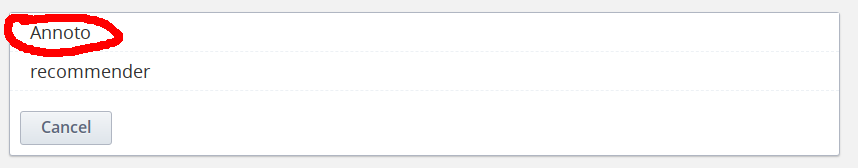

# xblock-in-video-collaboration
Annoto is an in-video collaboration solution that turns static, 1-way video Stream/VOD into an active and interactive group experience, where participants contribute, share and learn together.  Users can lean forward and become participants and not just passive and lonely viewers, causing all users to be actively involved and return to the video content, sharing more ideas and creating more meaningful content. Resulting in higher engagement and retention, supported by comprehensive analytics and insights, that facilitate dramatic improvements to content, communications, and measurable outcomes.

## Installation

```shell
sudo -sHu edxapp
source ~/edxapp_env
pip install -e "git+https://github.com/Annoto/xblock-in-video-collaboration.git#egg=xblock_annoto"
```

## Enabling in Studio

You can enable the Annoto xblock in studio through the advanced
settings:

1. From the main page of a specific course, click on *Settings*,
   *Advanced Settings* in the top menu.
2. Check for the *Advanced Module List* policy key, and add
   `"annoto"` in the policy value list.
    ```json
    [
        ...
        "annoto",
        ...
    ]
    ```
3. Add value `"annoto-auth:<annoto_client_id>:<annoto_client_secret>"` to *LTI Passports* list
    ```json
    [
        ...
        "annoto-auth:<annoto_client_id>:<annoto_client_secret>",
        ...
    ]
    ```
4. Click on the *Save changes* button.

## Usage

1. In course unit, add the video bock
    
2. Add Annoto xblock from advanced components
    
    
3. Reload page
